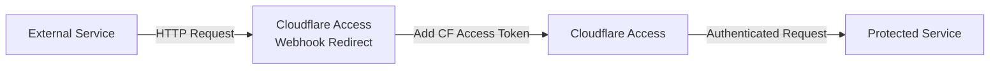

<!--
Generated from .github/templates/README.md.hbs — edit that file, not this one. CI renders it on
every pull request and commits the result back to the branch; a push to master whose README.md
does not match its template fails the `readme` check in .github/workflows/docs.yaml.

Variables come from .github/scripts/readme-variables.sh:

    version        the [package] version in Cargo.toml, e.g. 1.1.0
    tag            the same with a leading v, e.g. v1.1.0
    repo           this repository, for the badges and issue links
    image          DOCKER_REPO from .github/workflows/release-please.yaml
    config_loader  the loader's own variables, as a Markdown table
    config_keys    every configuration key, as a Markdown table

The last two are generated by `just render markdown-loader` and `just render markdown-keys`,
which walk the `Config` type — so the settings tables below cannot drift from the keys the
service actually reads. The first two are what keeps the pinned-image example correct across a
release: the release pull request is the commit that changes those numbers, so it arrives with
the rendered README already updated.
-->
<br/>
<p align="center">
  <h1 align="center">Cloudflare Access Webhook Redirect</h1>

  <p align="center">
    A lightweight, high-performance reverse proxy for exposing specific paths from Cloudflare Access-protected services
    <br />
    <br />
    <a href="https://github.com/TimSchoenle/cloudflare-access-webhook-redirect/issues">Report Bug</a>
    ·
    <a href="https://github.com/TimSchoenle/cloudflare-access-webhook-redirect/issues">Request Feature</a>
  </p>
</p>

<div align="center">


[](https://codecov.io/gh/TimSchoenle/cloudflare-access-webhook-redirect)


</div>

## 🎯 About The Project

Cloudflare Access Webhook Redirect is a high-performance reverse proxy written in Rust that enables selective exposure
of endpoints from services protected by Cloudflare Access. It automatically handles Cloudflare Access authentication by
injecting the required tokens into forwarded requests, allowing external services (like webhooks, monitoring tools, or
third-party integrations) to access specific paths without compromising the security of your entire application.

### Why This Project?

When using Cloudflare Access to protect your applications, you might encounter situations where:

- You need to expose webhook endpoints to external services (GitHub, Stripe, monitoring tools, etc.)
- Third-party integrations don't support Cloudflare Access authentication
- You want granular control over which endpoints are publicly accessible
- You need to maintain security while allowing selective access

This proxy sits between the external world and your Cloudflare Access-protected service, acting as an authenticated
gateway for specific paths.

## ✨ Features

| Status             | Feature                                                                                   |
|--------------------|-------------------------------------------------------------------------------------------|
| :heavy_check_mark: | **Multiple HTTP Methods** - Full support for GET, POST, PUT, PATCH, and DELETE operations |
| :heavy_check_mark: | **Path-Specific Forwarding** - Configure exactly which paths should be proxied            |
| :heavy_check_mark: | **Regex Path Matching** - Use powerful regular expressions for flexible path matching     |
| :heavy_check_mark: | **Query Parameter Support** - Preserves all query parameters in forwarded requests        |
| :heavy_check_mark: | **Request Body Forwarding** - Transparently forwards request bodies                       |
| :heavy_check_mark: | **Response Passthrough** - Returns the original response body and status code             |
| :heavy_check_mark: | **Health Check Endpoint** - Built-in `/health` endpoint for monitoring                    |
| :heavy_check_mark: | **Layered Configuration** - TOML file, environment, mounted secrets directory, `_FILE`    |
| :heavy_check_mark: | **Live Reload** - Rotate a mounted credential and the proxy rebuilds without a restart    |
| :heavy_check_mark: | **Source Provenance** - `debug` logging names the layer every configuration key came from |
| :heavy_check_mark: | **Sentry Integration** - Optional error tracking and monitoring                           |
| :heavy_check_mark: | **Structured Logging** - Comprehensive tracing with configurable log levels               |
| :heavy_check_mark: | **Minimal Docker Image** - Secure, distroless container (~10MB) built with musl           |
| :heavy_check_mark: | **Multi-Architecture Images** - Native `linux/amd64` and `linux/arm64` builds              |
| :hourglass:        | **Response Headers Forwarding** - Planned for future releases                             |

## 🏗️ Architecture



The proxy acts as an intermediary that:

1. Receives incoming requests from external services
2. Matches the request path against configured patterns
3. Injects Cloudflare Access tokens into the request
4. Forwards the request to your protected service
5. Returns the response back to the caller

## 🎯 Use Cases

- **Webhook Endpoints**: Expose GitHub webhooks, payment processor callbacks, or monitoring endpoints
- **Third-Party Integrations**: Allow services that don't support Cloudflare Access to reach specific endpoints
- **API Gateway**: Selectively expose API endpoints while keeping the rest protected
- **Monitoring**: Enable health checks and monitoring tools to access metrics endpoints

## 🚀 Quick Start

Write a `config.toml` (see [`config.example.toml`](config.example.toml)):

```toml
[server]
host = "0.0.0.0"

[cloudflare]
client_id = "your-client-id"
client_secret = "your-client-secret"

[webhook]
target_base = "https://your-protected-service.com"

[webhook.paths]
"/webhook/.*" = ["ALL"]
"/api/public/.*" = ["POST"]
```

and mount it at `/app/config.toml`, which is where the image looks:

```bash
docker run -p 8080:8080 \
  -v "$(pwd)/config.toml:/app/config.toml:ro" \
  timmi6790/cloudflare-access-webhook-redirect
```

## 📦 Installation

The published images are multi-architecture manifest lists covering `linux/amd64` and `linux/arm64`.
Docker selects the matching architecture automatically, so no platform flag is required.

Every example below pulls the floating `latest` tag, which is right for a deployment that should
follow releases and wrong for one where an unattended restart must not change the running
version. Pin the release instead — `v1.2.0` is the current one:

```
timmi6790/cloudflare-access-webhook-redirect:v1.2.0
```

Either way the tag is signed with [cosign](https://docs.sigstore.dev/) under this repository's
GitHub OIDC identity, so a pull can be verified against the workflow that pushed it.

### Docker

```bash
docker run -d \
  --name cf-webhook-redirect \
  --restart unless-stopped \
  -p 8080:8080 \
  -v "$(pwd)/config.toml:/app/config.toml:ro" \
  -v "$(pwd)/secrets:/run/secrets:ro" \
  -e WEBHOOK_REDIRECT_SECRETS_DIR=/run/secrets \
  timmi6790/cloudflare-access-webhook-redirect
```

With `secrets/cloudflare__client_id` and `secrets/cloudflare__client_secret` holding the service
token, the credentials stay out of both the image and the process environment. Rotating either
file is picked up without a restart.

### Docker Compose

```yaml
services:
  webhook-redirect:
    image: timmi6790/cloudflare-access-webhook-redirect
    container_name: cf-webhook-redirect
    restart: unless-stopped
    ports:
      - "8080:8080"
    volumes:
      - ./config.toml:/app/config.toml:ro
    environment:
      - WEBHOOK_REDIRECT_SERVER__HOST=0.0.0.0
      - WEBHOOK_REDIRECT_TELEMETRY__LOG_LEVEL=info
      - WEBHOOK_REDIRECT_SECRETS_DIR=/run/secrets
    secrets:
      - cloudflare__client_id
      - cloudflare__client_secret

secrets:
  cloudflare__client_id:
    file: ./secrets/client-id
  cloudflare__client_secret:
    file: ./secrets/client-secret
```

Compose mounts each secret at `/run/secrets/<name>`, so the secret names *are* the configuration
keys: `cloudflare__client_id` fills `cloudflare.client_id`.

### Kubernetes

The proxy is built for a projected `Secret` volume: it follows the `..data` symlink the kubelet
rewrites on rotation, and rebuilds itself when the mount changes rather than serving with a
credential that has since been revoked.

```yaml
apiVersion: v1
kind: ConfigMap
metadata:
  name: cf-webhook-redirect
data:
  config.toml: |
    [webhook]
    target_base = "https://your-protected-service.com"

    [webhook.paths]
    "/webhook/.*" = ["ALL"]
    "/api/public/.*" = ["POST"]
---
apiVersion: v1
kind: Secret
metadata:
  name: cf-access-credentials
type: Opaque
stringData:
  # The file names are the configuration keys: `__` separates nesting levels.
  cloudflare__client_id: your-client-id
  cloudflare__client_secret: your-client-secret
---
apiVersion: apps/v1
kind: Deployment
metadata:
  name: cf-webhook-redirect
  namespace: default
spec:
  replicas: 2
  selector:
    matchLabels:
      app: cf-webhook-redirect
  template:
    metadata:
      labels:
        app: cf-webhook-redirect
    spec:
      containers:
        - name: cf-webhook-redirect
          image: timmi6790/cloudflare-access-webhook-redirect
          ports:
            - containerPort: 8080
          env:
            - name: WEBHOOK_REDIRECT_SERVER__HOST
              value: "0.0.0.0"
            - name: WEBHOOK_REDIRECT_CONFIG
              value: /etc/cf-webhook-redirect/config.toml
            - name: WEBHOOK_REDIRECT_SECRETS_DIR
              value: /run/secrets
          volumeMounts:
            - name: config
              mountPath: /etc/cf-webhook-redirect
              readOnly: true
            - name: credentials
              mountPath: /run/secrets
              readOnly: true
          livenessProbe:
            httpGet:
              path: /health
              port: 8080
            initialDelaySeconds: 5
            periodSeconds: 10
          readinessProbe:
            httpGet:
              path: /health
              port: 8080
            initialDelaySeconds: 5
            periodSeconds: 10
          resources:
            requests:
              cpu: 100m
              memory: 64Mi
            limits:
              cpu: 200m
              memory: 128Mi
      volumes:
        - name: config
          configMap:
            name: cf-webhook-redirect
        - name: credentials
          secret:
            secretName: cf-access-credentials
---
apiVersion: v1
kind: Service
metadata:
  name: cf-webhook-redirect
spec:
  selector:
    app: cf-webhook-redirect
  ports:
    - port: 80
      targetPort: 8080
  type: ClusterIP
```

### Helm Chart

The official Helm chart is available in
the [TimSchoenle/helm-charts](https://github.com/TimSchoenle/helm-charts/tree/main/charts/cloudflare-access-webhook-redirect)
repository.

## ⚙️ Configuration

Configuration is layered by [terrace-config](https://github.com/TimSchoenle/terrace-config).
Lowest precedence first:

| # | Layer               | Source                                                    | Example                                     |
|---|---------------------|-----------------------------------------------------------|---------------------------------------------|
| 1 | Defaults            | built in                                                  | `server.port = 8080`                        |
| 2 | TOML                | `$WEBHOOK_REDIRECT_CONFIG`, defaulting to `./config.toml` | `[server]`<br>`port = 8080`                 |
| 3 | Environment         | `WEBHOOK_REDIRECT_`-prefixed, `__`-nested                 | `WEBHOOK_REDIRECT_SERVER__PORT=8080`        |
| 4 | Secrets directory   | every key-named file in `$WEBHOOK_REDIRECT_SECRETS_DIR`   | `/run/secrets/cloudflare__client_secret`    |
| 5 | File indirection    | `WEBHOOK_REDIRECT_<KEY>_FILE=/path`                       | `WEBHOOK_REDIRECT_CLOUDFLARE__CLIENT_SECRET_FILE=/run/secrets/cf` |

All five spell the same field the same way: `__` separates nesting levels and case is folded, so
`cloudflare.client_id` is `WEBHOOK_REDIRECT_CLOUDFLARE__CLIENT_ID` as a variable and
`cloudflare__client_id` as a file name.

**A key supplied by two of the last three layers fails the boot** rather than being resolved by
precedence: a stale environment variable shadowing a mounted secret that has since been rotated
would otherwise keep the proxy running on the revoked credential, and the discrepancy would
surface during an incident rather than during a deploy.

If `$WEBHOOK_REDIRECT_CONFIG` names a **directory**, every `*.toml` directly inside it is merged
in sorted order, which is how a mounted `ConfigMap` of `10-base.toml` and `20-overrides.toml`
behaves. A missing config file is not an error.

When the layer a value came from is the question — a rotated `Secret` that appears not to have
been picked up is the usual one — the boot log answers it. At `debug`, and on any boot that
fails to load, the proxy reports every key with the file or variable that supplied it and
anything it is shadowing. The report carries no configuration *value*, only the names, so it is
safe in a log the credentials themselves can never enter.

### Settings

Generated from the `Config` type, so a key that exists in the table exists in the service and a
key that does not is not configurable. `Flags` reads `required` when nothing supplies a default,
and `secret` when the value belongs in a mounted file rather than in this table's `Environment`
column. [`config.example.toml`](config.example.toml) is the same surface as a file to copy.

| TOML | Type | Environment | Default | Flags | Purpose |
|---|---|---|---|---|---|
| `server.host` | `String` | `WEBHOOK_REDIRECT_SERVER__HOST` | `127.0.0.1` | — | Bind address. Containers usually want `0.0.0.0`. |
| `server.port` | `u16` | `WEBHOOK_REDIRECT_SERVER__PORT` | `8080` | — | Bind port. |
| `telemetry.log_level` | `Level` | `WEBHOOK_REDIRECT_TELEMETRY__LOG_LEVEL` | `info` | — | Minimum level emitted by the subscriber (`trace`, `debug`, `info`, `warn`, `error`). |
| `telemetry.sentry_dsn` | `SecretString` | `WEBHOOK_REDIRECT_TELEMETRY__SENTRY_DSN` | unset | secret | Sentry DSN. Error reporting is disabled when absent. |
| `cloudflare.client_id` | `SecretString` | `WEBHOOK_REDIRECT_CLOUDFLARE__CLIENT_ID` | — | required, secret | `CF-Access-Client-Id` header value. |
| `cloudflare.client_secret` | `SecretString` | `WEBHOOK_REDIRECT_CLOUDFLARE__CLIENT_SECRET` | — | required, secret | `CF-Access-Client-Secret` header value. |
| `webhook.target_base` | `Url` | `WEBHOOK_REDIRECT_WEBHOOK__TARGET_BASE` | — | required | Base URL of the Cloudflare Access protected service every allowed path is joined onto. |
| `webhook.paths` | `HashMap<String, HashSet<AllowedMethod>>` | `WEBHOOK_REDIRECT_WEBHOOK__PATHS` | — | required | Path regex to the methods allowed on it. |

`webhook.paths` is a table, so it is the one setting the environment layer cannot express in
practice — the spelling in its `Environment` cell is mechanical, and a regex-keyed table has no
scalar form. It comes from the TOML file:

```toml
[webhook.paths]
"/webhook/.*" = ["ALL"]
"/api/public/.*" = ["GET", "POST"]
```

Two more spellings are derived from every row above rather than listed beside it: append `_FILE`
to the `Environment` cell to name a file holding the value, and substitute `__` for the dots in
the `TOML` cell to name that value's file inside the secrets directory.

Two variables configure the loader itself rather than the service, and are read straight from
the environment:

| Variable | Role | Default | Purpose |
|---|---|---|---|
| `WEBHOOK_REDIRECT_CONFIG` | config | `config.toml` | Names the TOML layer: a file, or a directory whose `*.toml` files are all merged in name order. |
| `WEBHOOK_REDIRECT_SECRETS_DIR` | secrets dir | — | Names a directory of key-named files — a mounted Kubernetes `Secret` volume. Each file supplies the key its name spells. |

### Reloading

The watched directories — the config file's directory, the secrets directory, and any `_FILE`
target's directory — are watched for changes. When one changes and then goes quiet for 500 ms,
the configuration is re-read and the proxy is rebuilt: new client, newly compiled path patterns,
new credentials, new listener. A reload that fails to load, or that resolves to the values
already running, leaves the running proxy exactly as it is and logs why.

`telemetry.*` is the exception. The tracing subscriber and the Sentry client are installed once
per process, before the reloadable runtime exists, so changing either still needs a restart.

### Migrating from the environment-only configuration

Releases before this one read unprefixed, dot-separated variables. The mapping:

| Before                     | After                                                                      |
|----------------------------|----------------------------------------------------------------------------|
| `SERVER.HOST`              | `WEBHOOK_REDIRECT_SERVER__HOST`                                            |
| `SERVER.PORT`              | `WEBHOOK_REDIRECT_SERVER__PORT`                                            |
| `CLOUDFLARE.CLIENT_ID`     | `WEBHOOK_REDIRECT_CLOUDFLARE__CLIENT_ID`                                   |
| `CLOUDFLARE.CLIENT_SECRET` | `WEBHOOK_REDIRECT_CLOUDFLARE__CLIENT_SECRET`                               |
| `WEBHOOK.TARGET_BASE`      | `WEBHOOK_REDIRECT_WEBHOOK__TARGET_BASE`                                    |
| `WEBHOOK.PATHS`            | the `[webhook.paths]` table in the config file                             |
| `LOG_LEVEL`                | `WEBHOOK_REDIRECT_TELEMETRY__LOG_LEVEL`                                    |
| `SENTRY_DSN`               | `WEBHOOK_REDIRECT_TELEMETRY__SENTRY_DSN`                                   |

`WEBHOOK.PATHS` packed every pattern into one string as `<regex>:<methods>` separated by `; `,
which made a pattern containing either separator unspellable. The table has no such limit:

```
WEBHOOK.PATHS=/webhook/.*:ALL; /api/public/.*:POST,GET
```

becomes

```toml
[webhook.paths]
"/webhook/.*" = ["ALL"]
"/api/public/.*" = ["POST", "GET"]
```

## 🤝 Contributing

1. Fork the Project
2. Create your Feature Branch (`git checkout -b feature/AmazingFeature`)
3. Commit your Changes (`git commit -m 'Add some AmazingFeature'`)
4. Push to the Branch (`git push origin feature/AmazingFeature`)
5. Open a Pull Request

Local tooling is [`just`](https://github.com/casey/just) recipes; `just` with no arguments lists
them. After changing anything in `src/config.rs`, run `just regenerate` — it rewrites
`docs/config.contract.json` and the `Dockerfile`'s `LABEL` region from the types, and CI fails a
pull request whose generated files do not match what those types produce. `just verify` is the
fmt/clippy/test the pull request is going to run anyway.

## 📝 License

Distributed under the GPL-3.0 License. See `LICENSE` for more information.
